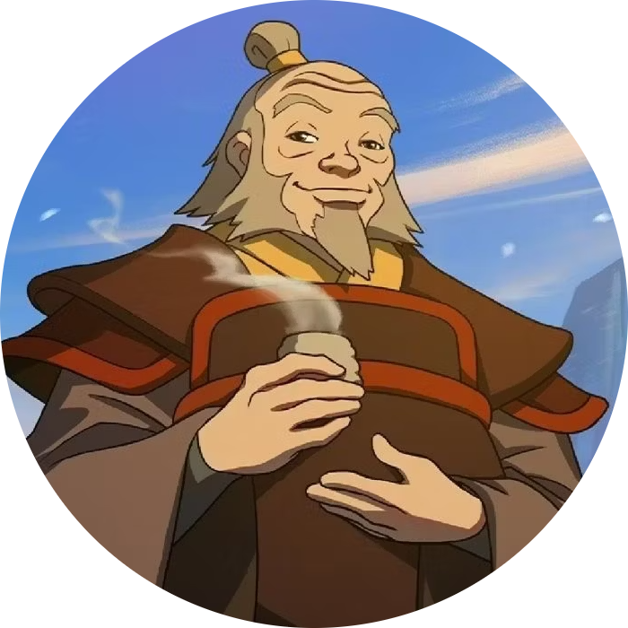

# Uncle Iroh

**_“Sharing tea with a fascinating stranger is one of life's true delights”_**

**Made with**

A Discord bot written entirely in [TypeScript](https://www.typescriptlang.org), made for Raven ⚡

